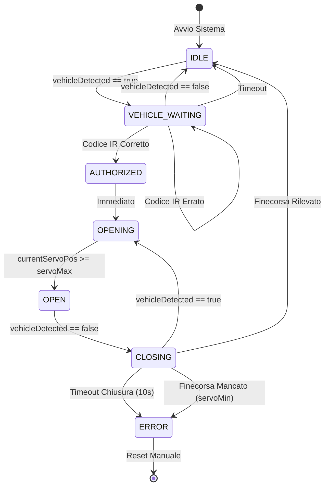
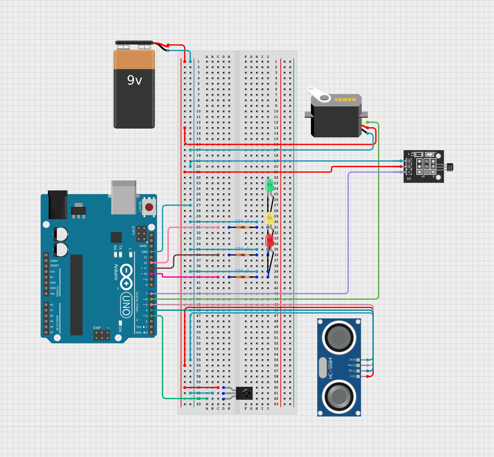

# Via Libera
- Autore: Riccardo Ruggi
- Descrizione: cancello smart che rileva veicoli e ne permette il passaggio a seguito di autorizzazione 
- Link a repo: https://github.com/riky-dev/via-libera
- Licenza scelta: GNU GPL v3
- Data indicativa di presentazione: fine Novembre 2025

## Descrizione
Il sistema può essere paragonato a una FSM con i seguenti stati:
1. Attesa (`IDLE`): La sbarra è chiusa (LED Rosso). Il sistema attende l'arrivo di un veicolo
2. Autorizzazione (`VEHICLE_WAITING`): Un veicolo viene rilevato dal sensore a ultrasuoni (LED Giallo). Il sistema attende un codice a 4 cifre dal telecomando IR, seguito dal tasto PLAY
3. Apertura (`OPENING`): Se il codice è corretto, la sbarra si alza (LED Verde).
4. Veicolo in Transito (`OPEN`): La sbarra resta aperta finché il veicolo non ha liberato l'area del sensore
5. Chiusura (`CLOSING`): Non appena il veicolo è passato, la sbarra inizia a chiudersi (LED Rosso)
6. Sicurezza: Se un ostacolo viene rilevato durante la chiusura, torna in `OPENING` per prevenire collisioni
7. Errore (`ERROR`): Se la sbarra non rileva il finecorsa  o impiega troppo tempo a chiudersi, il sistema entra in uno stato di errore (LED lampeggianti) per motivi di sicurezza richiedendo un reset manuale

## Componenti e Librerie

### Componenti Hardware
- Elegoo Uno R3
- Servo SG90
- Sensore a ultrasuoni HC-SR04
- Ricevitore IR + Telecomando
- 3 LED (Rosso, Giallo, Verde)
- 3 Resistenze da 220 Ohm
- Breadboard e cavi
- Sensore effetto Hall KY-003 e un magnete

### Librerie Software
- `<Servo.h>`  
- `<TaskScheduler.h>`
- `<IRremote.hpp>`
- `<SR04.h>`

## Schema

## Alimentazione
Stima:
- Arduino Uno: ~50 mA
- Sensori (IR + Ultrasuoni): ~20 mA
- LED (1 acceso): ~15 mA
- Servo (SG90) - Idle: ~10 mA
- Servo (SG90) - In movimento: ~150-250 mA

Il servo ha una corrente di stallo tra i 600 e 800mA, i quali superano i 500mA di una porta USB del PC. Ho dovuto quindi aggiungere un power supply esterno che fornisce tensione alla breadboard.

Durante lo sviluppo non ho incontrato problemi relativi alla tensione, probabilmente perché non sforzando mai il motore non ho mai raggiunto il picco.

## Foto
gif, foto, video

## Considerazioni
Potrei usare uno schermo LCD per le informazioni al posto di dover controllare la Serial Monitor, in questo modo non ci sarebbe bisogno di avere il prototipo connesso al PC.

